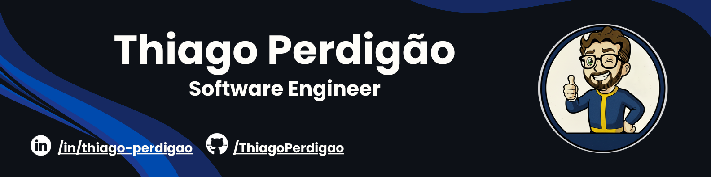
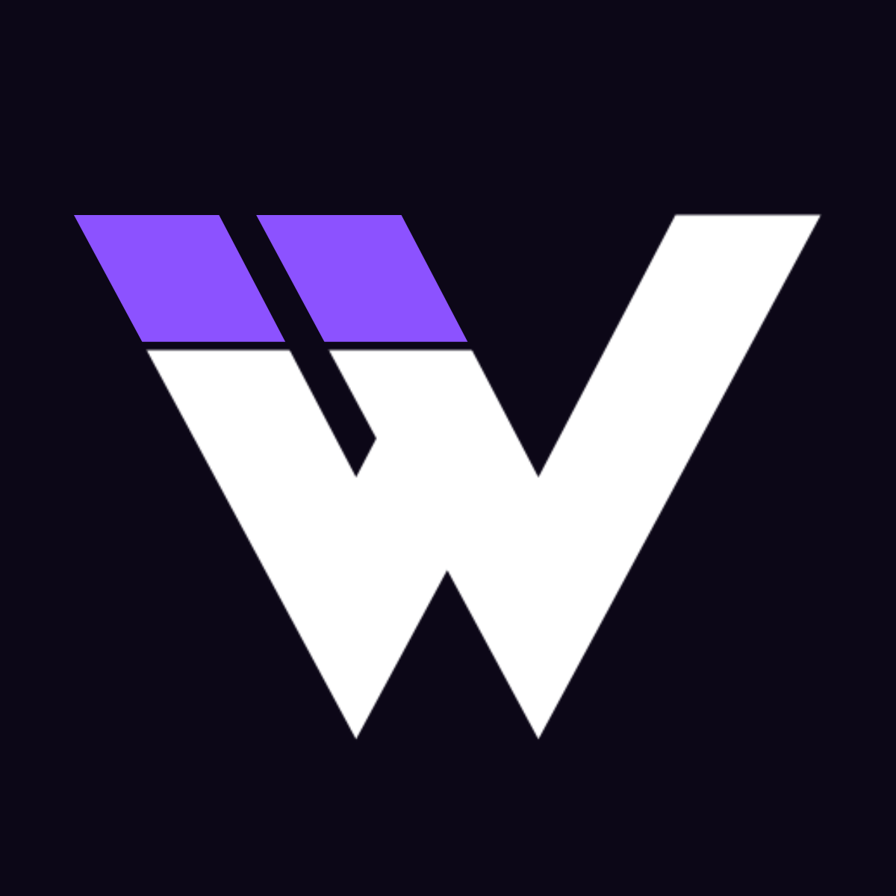

# 👋 Olá! Eu sou o Thiago Perdigão

Sou estudante de **Engenharia de Software na PUC Minas**, com sólida base em **desenvolvimento web e mobile**, além de experiência prática com **metodologias ágeis** e **qualidade de software**.  
Atualmente atuo como **desenvolvedor de software**, contribuindo para a construção de soluções eficientes, escaláveis e bem estruturadas.

Quer saber mais sobre mim?  
👉 Acesse meu portfólio: [**showcase-thiago-perdigao.vercel.app**](https://showcase-thiago-perdigao.vercel.app/)

---

---

## 🚀 Principais Projetos

<table>
  <tr>
    <td>
      
    </td>
    <td>
      <h3>🎮 <a href="https://perdigamez.vercel.app/">perdiGAMEZ — Site de jogos</a></h3>
      
<strong>Descrição:</strong> Plataforma web para pesquisa e visualização de informações sobre jogos, consumindo a API RAWG.

      
<strong>Tecnologias:</strong> React, TypeScript, Tailwind CSS

      
<strong>Links:</strong> 
        <a href="https://perdigamez.vercel.app/">Acessar Site</a> • 
        <a href="https://github.com/ThiagoPerdigao/perdigamez">Ver Repositório</a>
      

    </td>
  </tr>

  <tr>
    <td>
      
    </td>
    <td>
      <h3>📚 <a href="https://github.com/ThiagoPerdigao/webmarkermobile">webMarker — Marcador de leitura</a></h3>
      
<strong>Descrição:</strong> Aplicativo mobile para organização pessoal de leituras, permitindo registrar e acompanhar o progresso.

      
<strong>Tecnologias:</strong> React Native, Expo, SQLite, TypeScript

      
<strong>Links:</strong> 
        <a href="https://github.com/ThiagoPerdigao/webmarkermobile">Ver Repositório</a>
      

    </td>
  </tr>
</table>

---

## 📈 Tech Stats

<table>
  <tr>
    <td width="50%">
      
    </td>
    <td width="50%">
      
    </td>
  </tr>
</table>

---

## 🚀 Tech Stack

<table>
<tr>
 <td align="center" colspan="4"></td>
</tr> 
<tr>
<td></td>
<td></td>
<td></td>
<td></td>
</tr>
<tr>
<td></td>
<td></td>
<td></td>
<td></td>
</tr>
<tr>
<td></td>
<td></td>
<td></td>
<td></td>
</tr>
<tr>
<td></td>
<td></td>
<td></td>
<td></td>
</tr>
<tr>
 <td align="center" colspan="4"></td>
</tr> 
</table>

<table>
<tr>
 <td align="center" colspan="4"></td>
</tr> 
<tr>
<td></td>
<td></td>
<td></td>
<td></td>
</tr>
<tr>
<td></td>
<td></td>
<td></td>
<td></td>
</tr>
<tr>
 <td align="center" colspan="4"></td>
</tr> 
</table>

---
## 📫 Contato

💼 **Tem alguma proposta, parceria ou curiosidade?**  
Estou sempre aberto a novas oportunidades e conexões!

&nbsp;&nbsp;&nbsp;